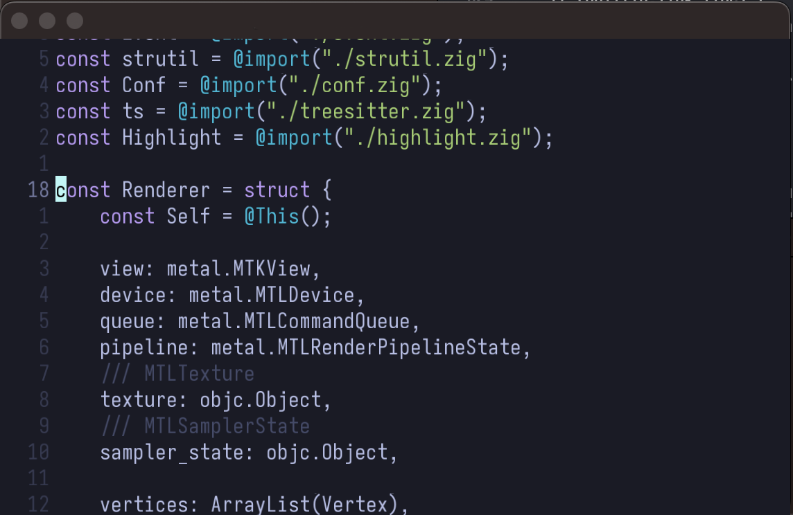

# tether

WIP high-performance code editor written in Zig. Inspired by Doom Emacs and neovim.

## Screenshots

## Currently implemented
- GPU accelerated text rendering using Metal + CoreText
- Smooth & swanky anti-aliased text rendering
- Font ligatures support
- Vim functionality
- Syntax highlighting with tree-sitter
